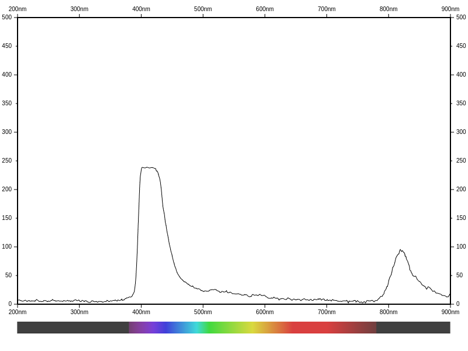

# bluespx - visual spectrum analyzer

This program is a web server that shows a spectrum plot for visible
light as measured by the [Spectryx
Blue](https://google.com/search?q=Spectryx%20Blue) mobile educational
spectrometer.

## Setup

```
$ git clone https://github.com/tinkerator/bluespx.git
$ cd bluespx
$ git submodule update
```

## Examples

These instructions assume you are running the `bluespx` program on Linux.

If you connect the Spectryx Blue device, via USB to your compter, and
run `sudo dmesg` the most recent entry will contain a reference to
which USB device file the newly plugged in device was assigned. The
`bluespx` program is assuming this device is `/dev/ttyUSB0` but, if it
is something else, you can use the `--tty` argument to specify that.

Running the program like this:
```
$ go run bluespx.go 
2024/07/03 18:31:26 sample captured
```
Then visit http://localhost:8080 to see something like this:


*NOTE* Due to some stability issues on different computers, you may
need to kill (CTRL-C) the binary and restart it to generate the next result.

With the UV lamp (bundled with the spectrometer) pointed at the end of
the probe. Visit, or reload, http://localhost:8080 page to see
something like this:



# Improvements planned

Figure out what can be done to stop the connection from locking up. Or
how to reconnect with the device when it appears the serial connection
to the device has stopped working.

## Notes for submodules

This was the setup for the plotter code:
```
$ git submodule add https://github.com/tinkerator/plotter.git
```

## License

See the [LICENSE](LICENSE) file. The license is the same as the one
the Go distribution itself uses.

## Reporting bugs and feature requests

The program `bluespx` has been developed purely out of self-interest
and a desire to extract data from one of these Spectroscope
devices. If you find a bug or want to suggest a feature addition,
please use the [bug
tracker](https://github.com/tinkerator/bluespx/issues).

## Acknowledgements

The spectrum pictographic rendering in the above views was inspired by
the following FORTRAN code:
https://www.physics.sfasu.edu/astro/color/spectra.html which was
originally authored by Dan Brouton.
